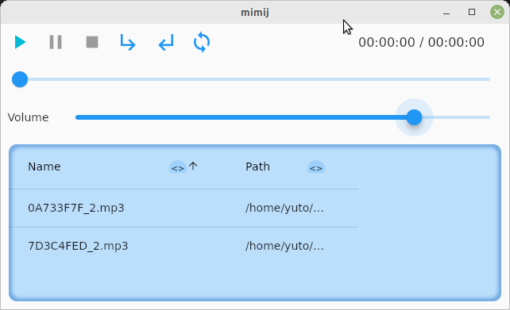

# mimij

An Audio Player.

## Logo


## Image





## Requiredment for Linux

This application uses [AudioPlayers](https://github.com/bluefireteam/audioplayers) that requires some dependencies. Please see the [requirements](https://github.com/bluefireteam/audioplayers/blob/main/packages/audioplayers_linux/requirements.md).

## When a Permission error occurs

You might face the following permission error

```shell
$ flutter run -d linux
Launching lib/main.dart on Linux in debug mode...
CMake Error at cmake_install.cmake:66 (file):
  file INSTALL cannot copy file
  "/home/development/mimij/build/linux/x64/debug/intermediates_do_not_run/mimij"
  to "/usr/local/mimij": Permission denied.


Building Linux application...                                           
Exception: Build process failed
```

Run `flutter clean` in this case.

```shell
flutter clean
flutter run -d linux
```

## Releasing for Linux

When executing **`snapcraft`**, the following error occurs and it's not possible to release at the moment.

```
CMake Error: The current CMakeCache.txt directory /root/parts/mimij/build/build/linux/x64/release/CMakeCache.txt is
different than the directory /home/user_name/development/mimij/build/linux/x64/release where CMakeCache.txt was created. This may
result in binaries being created in the wrong place. If you are not sure, reedit the CMakeCache.txt
[   +3 ms] CMake Error: The source "/root/parts/mimij/build/linux/CMakeLists.txt" does not match the source
"/home/user_name/development/mimij/linux/CMakeLists.txt" used to generate cache.  Re-run cmake with a different source directory.
```